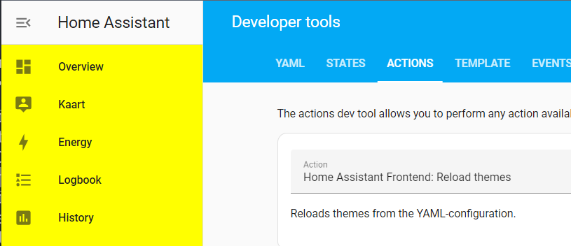
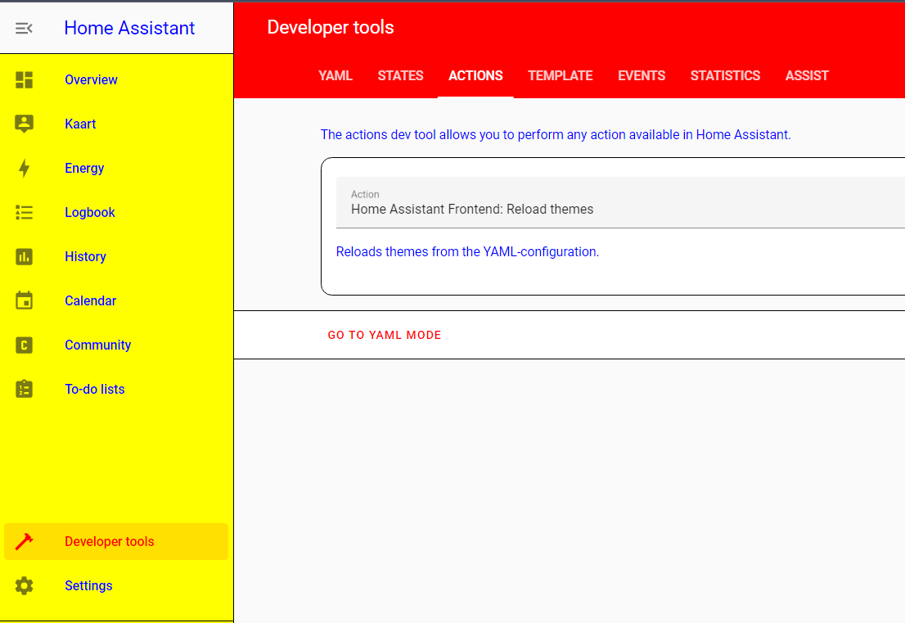
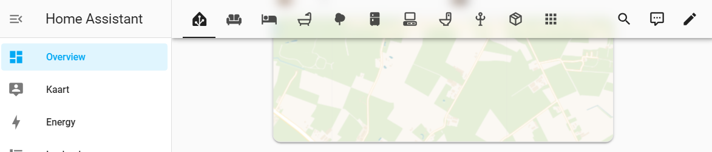

# Global Mod for Home Assistant

This is a custom Javascript module that can mod everything* in Home Assistant using local style elements. 

This module was inspired by Thomas Lovén's [card-mod](https://github.com/thomasloven/lovelace-card-mod), and can replace some parts of it. It works differently than card-mod. Therefore it is not a drop-in or full replacement.

## Installation

[](https://my.home-assistant.io/redirect/hacs_repository/?owner=alex3305&repository=lovelace-global-mod&category=lovelace)

### HACS

1. Add this repository as a custom **Lovelace** repository in HACS
2. Install Global Mod from HACS

### Manual

1. Copy [`global-mod.js`](global-mod.js) to your Home Assistant `/config/www/` directory
2. Enable advanced mode to [register resources](https://developers.home-assistant.io/docs/frontend/custom-ui/registering-resources)
3. Add `/local/global-mod.js` as a custom Javascript resource

> [!TIP]
> If Global Mod is loaded, it will report <span style="color:white;background:purple;"> Global Mod </span><span style="color:white;background:darkgreen;">vX.X.X </span> in the DevTools Console.

## Usage

### Home Assistant Themes Setup

After installing you can start adding mods to your configuration. Mods are added on theme level. Custom themes must be enabled and configured correctly. Themes can be configured with the [Frontend integration](https://www.home-assistant.io/integrations/frontend/). I have mine setup like this:

#### `configuration.yaml`

```yaml
---
homeassistant:
  customize: !include customize.yaml

default_config:
frontend:
  themes: !include_dir_merge_named themes
```

Besides my `configuration.yaml`, I also have a `themes` directory that can contain Theme configuration. My directory tree looks something like this:

```
├── automations.yaml
├── configuration.yaml
├── customize.yaml
├── themes
│   ├── default.yaml
│   ├── material-us.yaml
└── www
```

### Adding mods

Because Home Assistant only lets us create string key-values within themes, I use a special format to recognize mods before loading and applying them. A very basic mod would look something like this:

**`/config/themes/default.yaml`**

```yaml
---
default:
  yellow-drawer-selector: 'home-assistant-main$ha-drawer'
  yellow-drawer-style: |
    ha-sidebar { 
      background-color: yellow; 
    }
```

Which can be applied after saving to the correct path by calling the [Reload Themes](https://www.home-assistant.io/integrations/frontend/#setting-themes) service from [Developer Tools: Actions](https://my.home-assistant.io/redirect/developer_services/).

[](https://my.home-assistant.io/redirect/developer_services/)

> [!IMPORTANT]  
> This example mods the default theme.

The result should look like this:



If you want to create a custom theme, you are free to change the name from `default`. For instance:

**`/config/themes/test.yaml`**

```yaml
---
test:
  yellow-drawer-selector: 'home-assistant-main$ha-drawer'
  yellow-drawer-style: |
    ha-sidebar { 
      background-color: yellow; 
    }
```

Would create a theme called **test** with a yellow sidebar. In custom themes it's possible to override regular theme variables as well:

**`/config/themes/mondriaan.yaml`**

```yaml
---
Mondriaan:
  modes:
    dark: {}
    light:
      primary-color: red
      primary-text-color: blue
      divider-color: black

  yellow-drawer-selector: 'home-assistant-main$ha-drawer'
  yellow-drawer-style: |
    ha-sidebar { 
      background-color: yellow; 
    }
```

Which creates a [Mondriaan](https://en.wikipedia.org/wiki/Piet_Mondriaan) inspired theme called Mondiraan:



### Mod keys

The following keys are available for modding.

> [!IMPORTANT]  
> YAML formatting and syntax rules still apply. For instance duplicated keys will not be loaded.

#### `mod-name-selector` (required)

A DOM selector is required. This works almost the same as a regular DOM selector and is heavily inspired by card-mod. The main difference is that shadowRoot will be traversed with a `$`. For more information regarding DOM navigation I would like to refer to Thomas Lovén's excellent guide on [DOM navigation](https://github.com/thomasloven/lovelace-card-mod?tab=readme-ov-file#dom-navigation).

#### Examples

- `home-assistant-main$ha-drawer`
- `home-assistant-main$partial-panel-resolver ha-panel-lovelace$hui-root$`
- `home-assistant-main$ha-drawer ha-config-dashboard$`

> [!NOTE]  
> Note that a selector of `home-assistant$` will be prefixed to all given selectors, so an empty string (`""`) is a valid selector to select `home-assistant$`.

#### `mod-name-path`

The URL path on which the mod should be applied.

##### Examples

- `/lovelace/` would only be applied on the main dashboard
- `/config/` would only be applied within Configuration
- `automation` would be applied on all URL's containing the word `automation`

#### `mod-name-style`

A CSS style that should be applied to the selected element.

#### `mod-name-style-dark`

A CSS style that should be applied to the selected element, but only in dark mode. 

#### `mod-name-style-light`

A CSS style that should be applied to the selected element, but only in light mode. 

#### `mod-name-disable-on-edit`

A boolean whether or not the mod should be disabled when entering edit mode.

## Troubleshooting (FAQ)

### Is Global Mod loaded?

Global Mod will report <span style="color:white;background:purple;"> Global Mod </span><span style="color:white;background:darkgreen;">vX.X.X </span> in the DevTools Console when it is loaded correctly.

### Is my style appended?

You can search for `global-mod` within the DevTools Elements Inspector to see which Style elements are applied. Every Global Mod will have that class set.

### Combining with card-mod themes

It is possible to combine Global Mod with card-mod themes, but it can be necessary to set the following mod:

```yaml
---
default:
  root-selector: ""
  root-style: |
    :host, * { --card-mod-theme: default; }
```

This will replace the `card-mod-theme` key.

### Overriding default theme variables doesn't work

This is due to how the default theme in Home Assistant works. However it is possible to override theme variables with Global Mod. Going back to the Mondriaan-esque example from above, but applying it to the default theme:

```yaml
---
# This does not work!
default:
  modes:
    dark: {}
    light:
      primary-text-color: blue
      divider-color: black
  
  primary-color: red
```

This does not work. But it is possible to override it directly in CSS with Global Mod:

```yaml
---
default:
  modes:
    dark: {}
    light: {}

  root-selector: ""
  root-style: |
    :host {
      --primary-color: red;
    }
  root-style-light: |
    :host {
      --primary-text-color: blue;
      --divider-color: black;
    }
```

## Examples

### Frosted glass header



```yaml
root-selector: ""
root-style: |
  :host {
    --app-header-background-color: transparent;
    --app-header-backdrop-filter: blur(8px);
    --app-header-text-color: var(--primary-text-color);
    --dialog-backdrop-filter: brightness(80%) var(--app-header-backdrop-filter);
    --dialog-box-shadow: var(--material-shadow-elevation-6dp);
  }
```

### Gradient background

```yaml
root-selector: ""
root-style: |
  ha-drawer {
    background: var(--view-background);
  }
root-style-light: | 
  :host {
    --view-background: linear-gradient(340deg,
                          var(--primary-background-color),
                          color-mix(in srgb, var(--primary-background-color), var(--primary-color) 2%) 20%,
                          var(--card-background-color) 100%);
  }
root-style-dark: | 
  :host {
    --view-background: linear-gradient(340deg,
                          var(--card-background-color),
                          color-mix(in srgb, var(--primary-background-color), var(--primary-color) 5%) 20%,
                          var(--primary-background-color) 100%);
  }
```

### Drawer gradient background

```yaml
drawer-background-selector: home-assistant-main$ha-drawer$
drawer-background-style: |
  aside.mdc-drawer {
    background: linear-gradient(340deg,
                      color-mix(in srgb, var(--primary-color), transparent 75%),
                      color-mix(in srgb, var(--primary-color), transparent 85%) 50%,
                      color-mix(in srgb, var(--primary-color), transparent 95%) 100%);
  }

sidebar-no-background-selector: home-assistant-main$ha-drawer
sidebar-no-background-style: |
  ha-sidebar {
    background: transparent;
    --sidebar-menu-button-background-color: transparent;
  }
```

### Drawer modal blur

```yaml
drawer-modal-blur-selector: home-assistant-main$ha-drawer$
drawer-modal-blur-style: |
  :host([open]) .mdc-drawer-scrim {
    backdrop-filter: var(--dialog-backdrop-filter);
  }
```

### Remove action menu on mobile

```yaml
no-action-menu-on-mobile-path: "/lovelace/"
no-action-menu-on-mobile-selector: home-assistant-main$partial-panel-resolver ha-panel-lovelace$hui-root$
no-action-menu-on-mobile-style: |
  @media all and (max-width: 767px) {
    .toolbar .action-items { display:none!important; }
  } 
```

### Hidden action menu

Which will become visible if you hover over the toolbar.

```yaml
hidden-action-menu-path: "/lovelace/"
hidden-action-menu-selector: home-assistant-main$partial-panel-resolver ha-panel-lovelace$hui-root$
hidden-action-menu-style: |
  .toolbar .action-items {
    visibility: hidden;
    opacity: 0;
    transition: opacity 0.4s linear;
  }
  
  .toolbar:hover .action-items,
  .edit-mode .toolbar .action-items {
    visibility: visible;
    opacity: 1;
    transition: opacity 0.4s linear;
  }
```

### Remove header tabs chevrons

This removes the left and right arrows from the paper tabs, which will give the menu items more space.

```yaml
no-paper-tabs-chevrons-lovelace-path: "/lovelace/"
no-paper-tabs-chevrons-lovelace-disable-on-edit: true
no-paper-tabs-chevrons-lovelace-selector: home-assistant-main$partial-panel-resolver ha-panel-lovelace$hui-root$div ha-tabs$
no-paper-tabs-chevrons-lovelace-style: |
  paper-icon-button { display:none!important; }

no-paper-tabs-chevrons-devtools-path: "/developer-tools/"
no-paper-tabs-chevrons-devtools-selector: home-assistant-main$partial-panel-resolver ha-panel-developer-tools$paper-tabs$
no-paper-tabs-chevrons-devtools-style: |
  paper-icon-button { display:none!important; }
```

### Remove tip from Configuration

```yaml
remove-tip-path: "/config/dashboard"
remove-tip-selector: home-assistant-main$ha-drawer ha-config-dashboard$
remove-tip-style: |
  ha-tip {
    margin: 0!important;
    visibility: hidden;
  }
```

### Remove Home Assistant Cloud ads

```yaml
remove-cloud-config-path: "/config/dashboard"
remove-cloud-config-selector: home-assistant-main$ha-drawer ha-config-dashboard$ha-config-navigation$ha-navigation-list$
remove-cloud-config-style: |
  mwc-list ha-list-item:first-of-type {
    display: none;
  }    

remove-cloud-discover-path: "/config/voice-assistants/assistants"
remove-cloud-discover-selector: home-assistant-main$ha-drawer ha-config-voice-assistants-assistants$
remove-cloud-discover-style: |
  cloud-discover {
    display: none!important;
  }    
```
