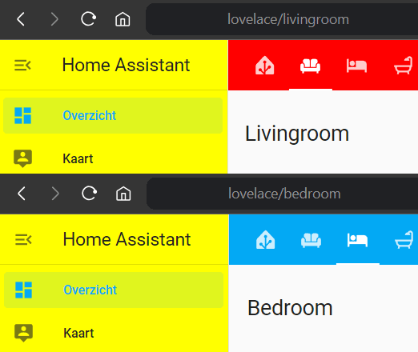

# Global mod for Home Assistant

A custom script that can mod everything in Home Assistant using local style elements. Inspired by the Thomas Lovén's [card-mod](https://github.com/thomasloven/lovelace-card-mod).

## Installing

### HACS

1. Add this repo as custom **Lovelace** repository to HACS
2. Install this component

### Manual 

1. Copy the `global-mod.js` to your `/config/www/` directory
2. Enable advanced mode to [register resources](https://developers.home-assistant.io/docs/frontend/custom-ui/registering-resources)
3. Add `/local/global-mod.js` as a custom resource

## Usage

### Basic usage

1. Add a `-global-mod` theme
2. Reload your themes
3. Refresh your browser

### How it works

Modding is based on theme variables. So basically you'll need to add a special `-global-mod` theme prefixed with the name of your current theme. So for default this will be `default-global-mod`. There you can add `path`, `selector`, `style`, `style-light` and `style-dark` keys for modding. You can also easily override CSS variables within the style elements. See below for a complete example.

### Available keys

| Key                | Usage |
| ------------------ | ------ |
| `NAME-path`        | The URL path that is used to match on. |
| `NAME-selector`    | The DOM selector that is used to place the CSS Style element on. |
| `NAME-style`       | Your CSS style (mod) that is applied regardless of light or dark mode. |
| `NAME-style-light` | Your CSS style (mod) that is only applied in light mode. |
| `NAME-style-dark`  | Your CSS style (mod) that is only applied in dark mode. |

> [!IMPORTANT]  
> Don't use hyphens (-) in your mod name. I recommend that you use camelCase as seen below.

### DOM navigation

Shadow Root elements are identified by `$` to align with [card-mod](https://github.com/thomasloven/lovelace-card-mod) for more information check out their readme on [DOM navigation](https://github.com/thomasloven/lovelace-card-mod?tab=readme-ov-file#dom-navigation).

> [!NOTE]  
> Note that a selector of `home-assistant$` will be prefixed to all given selectors, because all styled elements are within this context.

### Reloading themes

Reloading themes can be done from the **Services** tab in **Developer Tools**:
[](https://my.home-assistant.io/redirect/developer_services/)

> [!IMPORTANT]  
> You need to refresh your browser after reloading themes for the theme to take effect.

### Basic Example

```yaml
default-global-mod:
  yellowDrawer-path: '/'
  yellowDrawer-selector: 'home-assistant-main$ha-drawer'
  yellowDrawer-style: |
    ha-sidebar { 
      background-color: yellow; 
    }
  
  livingroom-path: 'livingroom'
  livingroom-selector: 'home-assistant-main$partial-panel-resolver ha-panel-lovelace$hui-root$div'
  livingroom-style: |
    .header { 
      --app-header-background-color: red; 
    }
```

This example will mod the default theme and
- On every page including an `/` (which are all pages) the `ha-drawer` will have a yellow background color
- On the livingroom page, the header will have a red background color



## Troubleshooting

You can search for HTML style elements `global-mod` class to see where your mods are being placed. In addition this script generates console logging if something goes wrong.

## Examples

### Transparent Header

Header will be transparent except for when you can scroll, than it reverts to the primary header color.

```yaml
  transparentHeader-path: 'lovelace/'
  transparentHeader-selector: 'home-assistant-main$partial-panel-resolver ha-panel-lovelace$hui-root$div'
  transparentHeader-style: |
    .header {
      --app-header-background-color: transparent;
      --app-header-text-color: var(--primary-text-color);
      transition: background-color 0.5s ease, color 0.5s ease;
    }

    :host([scrolled]) .header {
      --app-header-background-color: unset;
      --app-header-text-color: unset;
      transition: background-color 0.5s ease, color 0.5s ease;
    }
```

### Hide action items (search, assistant, edit) when unused

This will also show them when you mouse over (hover) the toolbar.

```yaml
  hideActionItems-path: 'lovelace/'
  hideActionItems-selector: 'home-assistant-main$partial-panel-resolver ha-panel-lovelace$hui-root$div'
  hideActionItems-style: |
    .toolbar .action-items { 
      visibility: hidden; 
      opacity: 0;
      transition: opacity 0.4s linear;
    }
    
    .toolbar:hover .action-items, .edit-mode .toolbar .action-items { 
      visibility: visible;
      opacity: 1;
      transition: opacity 0.4s linear;
    }
```

### Remove action items (edit) on mobile devices

This will completely remove the overflow menu on mobile devices.

```yaml
  removeEditOnMobile-path: 'lovelace/'
  removeEditOnMobile-selector: 'home-assistant-main$partial-panel-resolver ha-panel-lovelace$hui-root$div'
  removeEditOnMobile-style: |
    @media all and (max-width: 767px) {
      .toolbar .action-items { display:none!important; }
    }
```

### Remove header tab chevrons

Never show the tab chevrons to get more screen width for dashboard tabs.

```yaml
  removeHeaderTabChevrons-path: 'lovelace/'
  removeHeaderTabChevrons-selector: 'home-assistant-main$partial-panel-resolver ha-panel-lovelace$hui-root$div ha-tabs$'
  removeHeaderTabChevrons-style: 'paper-icon-button { display:none!important; }'
```

### Transparent header in Configuration section

```yaml
  transparentHeaderConfig-path: 'config/dashboard'
  transparentHeaderConfig-selector: home-assistant-main$partial-panel-resolver ha-config-dashboard$ha-top-app-bar-fixed$
  transparentHeaderConfig-style: |
    header {
      --app-header-background-color: transparent;
      --app-header-text-color: var(--primary-text-color);
      --app-header-border-bottom: none!important;
      transition: background-color 0.5s ease, color 0.5s ease;
    }

    header.mdc-top-app-bar--fixed-scrolled {
      --app-header-background-color: unset;
      --app-header-text-color: unset;
      --app-header-border-bottom: unset;
      transition: background-color 0.5s ease, color 0.5s ease;
    }
```

### Remove tip element in config

```yaml
  removeTip-path: 'config/dashboard'
  removeTip-selector: 'home-assistant-main$ha-drawer ha-config-dashboard$'
  removeTip-style: 'ha-tip { display: none!important; }'
```

### Replace subview header title with image

```yaml
  rituals-path: rituals-perfume-genie
  rituals-selector: home-assistant-main$partial-panel-resolver ha-panel-lovelace$hui-root$
  rituals-style: |
    .header { 
      --app-header-text-color: #fff; 
      box-shadow: var(--material-shadow-elevation-16dp);
    }
    @media all and (max-width: 767px) {
      .toolbar .action-items { display:none!important; }
      .main-title { --margin-title: 2px 24px 0 12px; }
    }

    .main-title {
      background-image: url(https://brands.home-assistant.io/rituals_perfume_genie/logo.png);
      background-position: top left;
      background-size: contain;
      background-repeat: no-repeat;
      color: transparent;
      filter: invert(100%);
    }
  rituals-style-dark: |
    .header { --app-header-background-color: #1a1919; }
  rituals-style-light: |
    .header { --app-header-background-color: #242222; }
```
